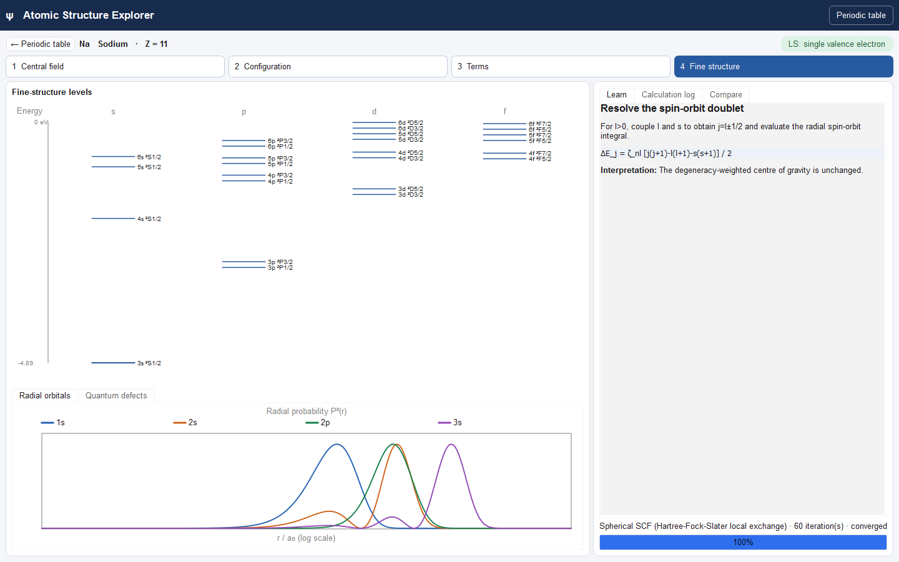

# Atomic Structure Explorer

<p align="center">
  
</p>

**Atomic Structure Explorer** is an interactive desktop application for undergraduate atomic physics. It shows how a central-field calculation leads from radial orbitals to electron configurations, spectroscopic terms, and approximate fine-structure levels.

Calculations run locally, so the application works offline after installation.

## Download

Open the repository’s [**Releases** page](../../releases) and download the installer for your computer:

- **Windows x64:** `AtomicStructureExplorer-Windows-x64-Setup.exe`
- **Apple Silicon Mac:** `AtomicStructureExplorer-macOS-arm64.dmg`

On Windows, run the setup program and choose whether to create a desktop shortcut. On macOS, open the disk image and drag **Atomic Structure Explorer** to the **Applications** shortcut.

The current downloads are unsigned development builds. Windows SmartScreen or macOS Gatekeeper may display a warning. If you would rather not run an unsigned application, follow the source-installation instructions below.

## Quick start

### 1. Choose an element

The opening screen is an interactive periodic table. Select an element to calculate its neutral-atom orbitals and ground configuration.


Blue tiles identify the implemented one-valence teaching family and green tiles the two-valence family. Every element supports the central-field and configuration views; the more detailed features depend on the element’s valence structure.

### 2. Follow the four stages

Use the numbered buttons across the top of the workspace:

1. **Central field** shows the calculated one-electron orbitals.
2. **Configuration** shows how those orbitals are occupied and compares the calculated filling with the accepted ground-state configuration.
3. **Terms** shows the supported spectroscopic terms produced by residual electrostatic interactions.
4. **Fine structure** resolves supported terms into approximate spin-orbit levels.

The energy diagram changes as you move between stages. If the selected atom is outside the implemented term or fine-structure models, the application explains that boundary instead of inventing a result.



### 3. Explore the radial orbitals

The **Radial orbitals** panel plots radial probability against radius on a logarithmic scale.

- Each orbital has a colour-matched legend entry.
- Move the pointer over a curve to see its orbital label, energy, and occupation.
- Compare the positions and penetration of `s`, `p`, `d`, and `f` orbitals.

### 4. Examine quantum defects for alkali metals

For alkali-metal atoms, open the **Quantum defects** tab below the energy diagram. It lists calculated Rydberg-series binding energies and quantum defects for different angular momenta.

Try sodium to see the characteristic ordering `δs > δp > δd ≈ 0`. For other element families, the tab explains why this particular analysis is unavailable.

### 5. Read the explanation and calculation log

The tabs on the right provide different levels of detail:

- **Learn** explains the physical step represented by the selected stage.
- **Calculation log** exposes the numerical and modelling decisions made during the calculation.
- **Compare** places the calculated electron filling beside the accepted configuration and states the reference-data limitations.

The status and warning areas identify convergence results, LS-coupling limits, and other cautions that affect interpretation.

## Things to try

- **Hydrogen:** compare the familiar Coulomb orbitals and level structure.
- **Sodium:** inspect Rydberg levels, quantum defects, and spin-orbit doublets.
- **Magnesium:** compare singlet and triplet terms for a two-valence-electron example.
- **Chromium or copper:** inspect how competing occupations produce their well-known filling exceptions.
- **A heavier atom:** explore its central-field orbitals and note where the detailed model stops.

## Interpreting the results

Atomic Structure Explorer is a teaching model rather than a precision spectroscopy package.

- Hydrogen uses the exact Coulomb central field.
- Multi-electron atoms use a numerical spherical Hartree self-consistent field with local Dirac/Slater exchange and a Latter tail correction.
- The local exchange approximation is not exact Hartree–Fock.
- Correlation and relativistic effects are not treated systematically.
- Detailed term and fine-structure calculations are limited to selected valence structures.
- Calculated orbital and level energies should not be treated as precision experimental transition data.

## Run from source

Python 3.11 or newer is required.

```bash
python -m venv .venv
python -m pip install -e ".[dev]"
python -m atomic_structure_explorer
```

Activate the virtual environment before installing when required by your shell. On Windows PowerShell:

```powershell
.venv\Scripts\Activate.ps1
```

Run the tests with:

```bash
python -m pytest
```

## Licence

Released under the [MIT License](LICENSE).
